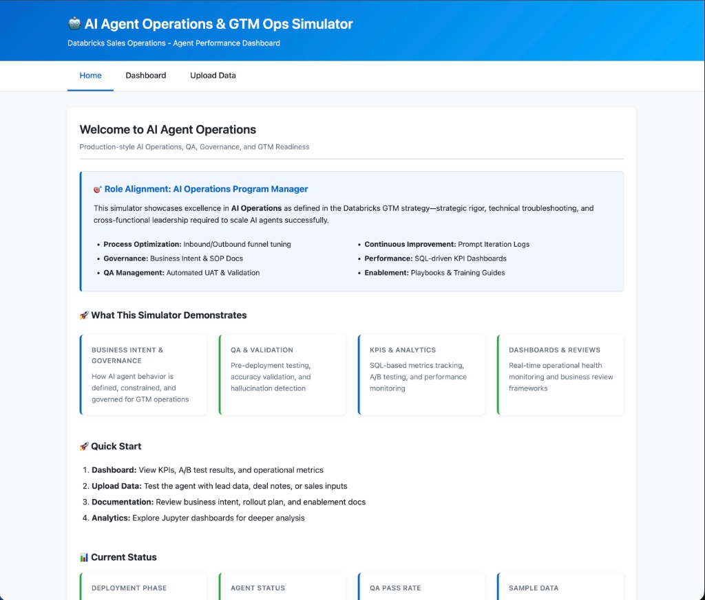
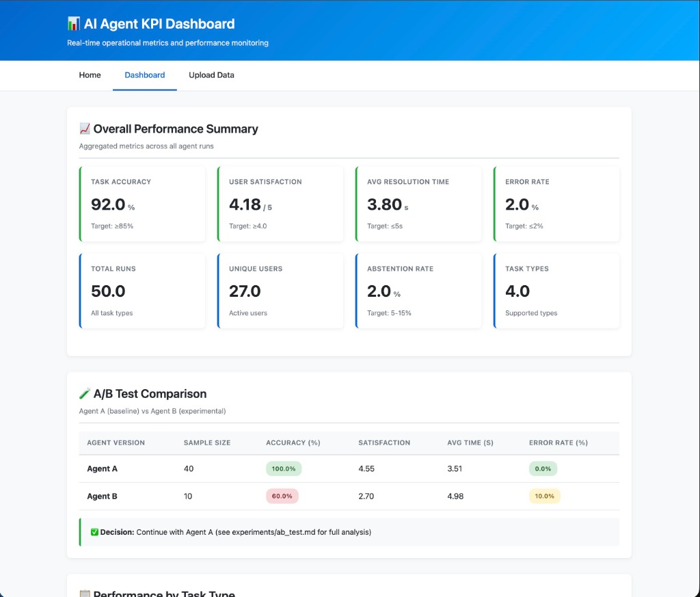
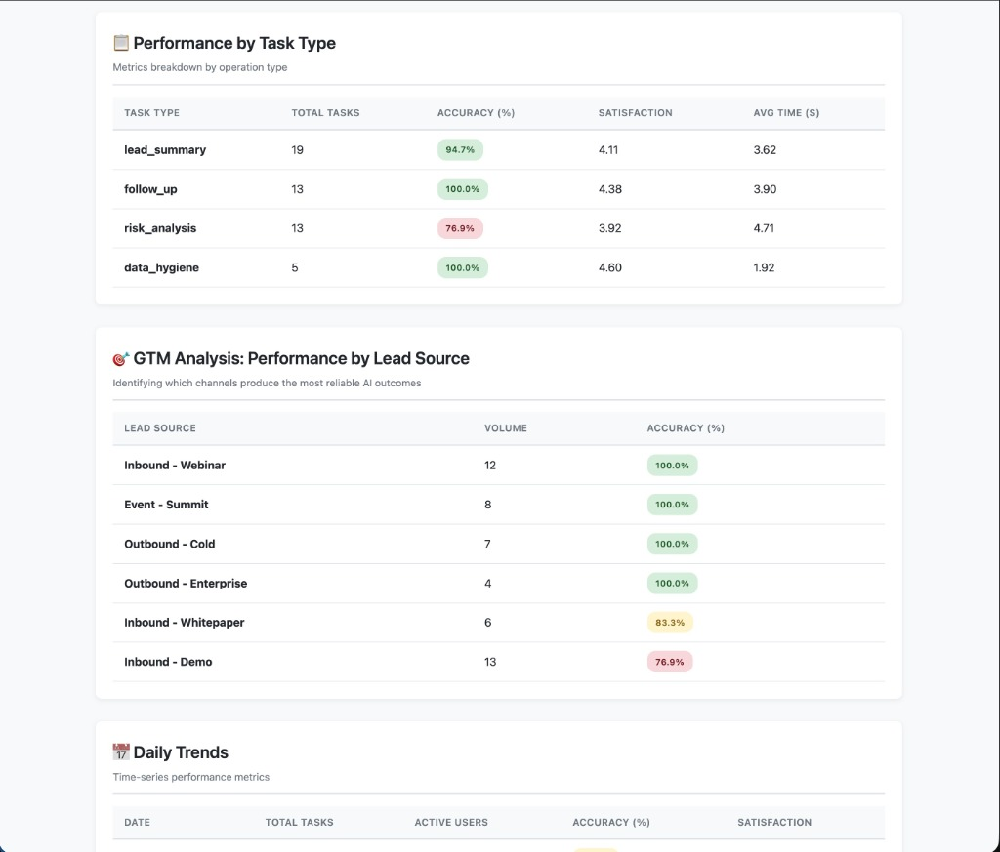
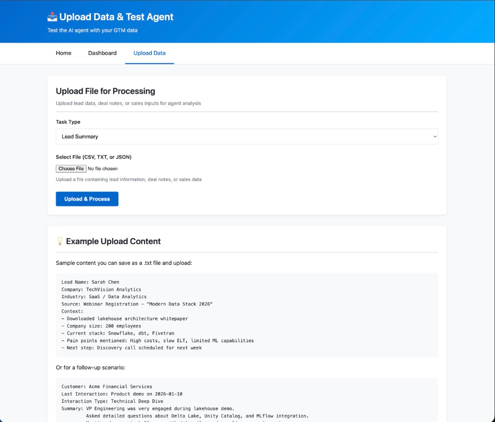
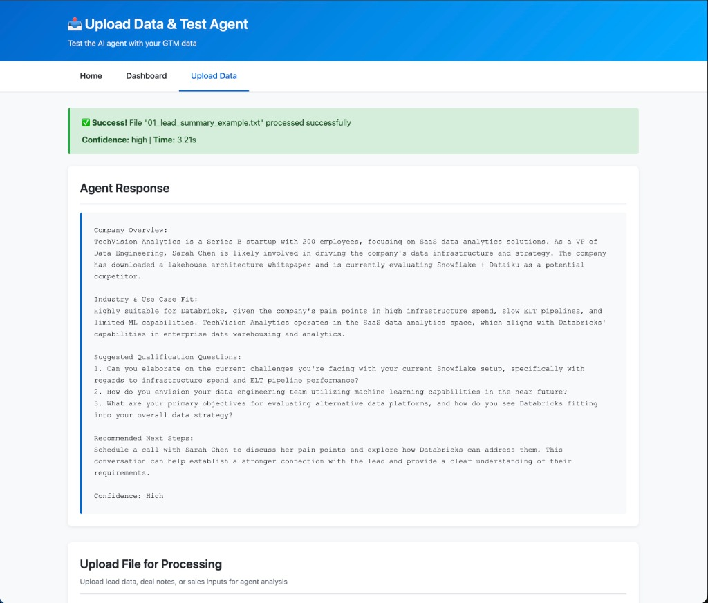
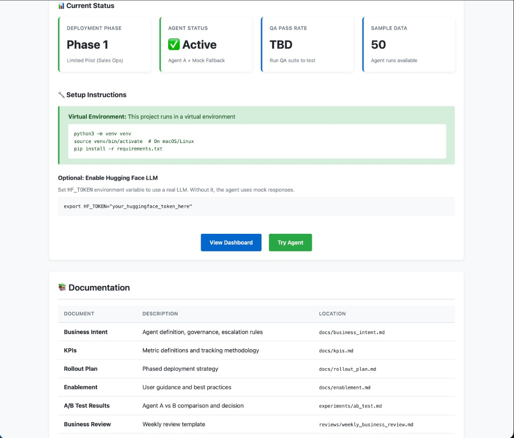

# Databricks AI Agent Operations & GTM Ops Simulator

A production-style **AI Agent Operations & GTM Ops Simulator** demonstrating how AI agents are defined, governed, QA'd, monitored, and rolled out inside a sales-facing environment.

This project showcases **AI Operations, QA, governance, KPIs, dashboards, A/B testing, enablement, and GTM readiness** for a modern data and AI company.

## 🎯 Project Overview

This simulator demonstrates:

- **Business Intent & Governance** - How AI agent behavior is defined and constrained
- **AI Agent Operations** - Agent implementation using Hugging Face LLMs
- **QA & Validation** - Pre-deployment testing and validation workflows
- **KPIs & Analytics** - SQL-based metrics tracking and analysis
- **Dashboards** - Operational health monitoring (web + Jupyter)
- **A/B Testing** - Data-driven rollout decisions
- **Enablement** - User guidance and business reviews

## 🏗️ Project Structure

```
Databricks-AI-Agent-Operations-&-GTM-Ops-Simulator/
├── README.md                          # This file
├── requirements.txt                   # Python dependencies
├── .gitignore                         # Git exclusions
│
├── docs/                              # Business documentation
│   ├── business_intent.md            # Agent definition & governance
│   ├── kpis.md                       # KPI definitions
│   ├── rollout_plan.md               # Deployment strategy
│   └── enablement.md                 # User guidance
│
├── agent/                             # AI Agent implementation
│   ├── agent.py                      # Core agent logic
│   └── prompts.py                    # Prompt templates
│
├── qa/                                # Quality assurance
│   ├── test_cases.json               # Structured test cases
│   └── run_qa.py                     # QA test runner
│
├── data/                              # Data storage
│   ├── sample_agent_runs.csv         # Sample agent interaction data
│   └── uploaded_inputs/              # User-uploaded files
│
├── analytics/                         # Data analytics
│   ├── load_data.py                  # Data ingestion
│   └── queries.sql                   # SQL queries for KPIs
│
├── dashboards/                        # Visualization
│   └── kpi_dashboard.ipynb           # Jupyter dashboard
│
├── experiments/                       # A/B testing
│   └── ab_test.md                    # Experiment documentation
│
├── reviews/                           # Business reviews
│   └── weekly_business_review.md     # Review template
│
└── webapp/                            # Web application
    ├── app.py                        # FastAPI application
    ├── templates/                    # HTML templates
    │   ├── index.html               # Home page
    │   ├── dashboard.html           # KPI dashboard
    │   └── upload.html              # File upload
    └── static/                       # CSS & assets
        └── styles.css               # Styling
```

## 🚀 Setup Instructions

### 1. Create Virtual Environment

```bash
# Navigate to project directory
cd Databricks-AI-Agent-Operations-&-GTM-Ops-Simulator

# Create virtual environment
python3 -m venv venv

# Activate virtual environment
# macOS/Linux:
source venv/bin/activate
# Windows:
# venv\Scripts\activate
```

### 2. Install Dependencies

```bash
pip install --upgrade pip
pip install -r requirements.txt
```

### 3. Configure Hugging Face Token (Optional)

The agent can use a free Hugging Face LLM. To enable this:

1. Get a free access token from [Hugging Face](https://huggingface.co/settings/tokens)
2. Set the environment variable:

```bash
export HF_TOKEN="your_huggingface_token_here"
```

**Note:** The agent will use mock responses if `HF_TOKEN` is not set, allowing you to explore the system without an LLM.

### 4. Run the Web Application

```bash
cd webapp
uvicorn app:app --reload --host 0.0.0.0 --port 8000
```

Open your browser to: `http://localhost:8000`

### 5. Explore the Jupyter Dashboard

```bash
jupyter notebook dashboards/kpi_dashboard.ipynb
```

## 📸 Screenshots

### Home Page
The landing page provides an overview of the simulator, role alignment with the AI Operations PM position, and quick access to all features.



### KPI Dashboard
Real-time operational metrics including Task Accuracy (92%), User Satisfaction (4.18/5), Resolution Time, and Error Rate. Also shows A/B test results comparing Agent A vs Agent B performance.



### GTM Analytics
Performance breakdown by Task Type and Lead Source, enabling strategic decisions about which channels produce the most reliable AI outcomes.



### Upload & Test Agent
Upload lead data, deal notes, or sales inputs to test the AI agent. Select a task type and receive real LLM-powered analysis.



### AI Agent Response (LLM Output)
Real AI-generated analysis from the Llama-3.2 model. The agent provides a Company Overview, Industry & Use Case Fit, Suggested Qualification Questions, and Recommended Next Steps—all in ~3 seconds.



### Documentation & Setup
Quick access to setup instructions, documentation links, and current deployment status.



## 🎯 Role Alignment: AI Operations Program Manager
This project is specifically designed to demonstrate the core competencies of the **AI Operations Program Manager** role at Databricks, focusing on:

- **End-to-End Lifecycle Management**: From Business Intent to Field Enablement.
- **Analytical Performance Monitoring**: SQL-driven dashboards for KPI optimization.
- **Governance & Accountability**: Automated QA, human-in-the-loop escalation, and UAT frameworks.
- **Continuous Improvement**: Documented **Prompt Iteration Logs** based on field feedback.
- **Stakeholder Leadership**: Weekly Business Review (WBR) templates for cross-functional alignment.

## 🚀 Key Features

### AI Agent
- Accepts GTM tasks (lead summaries, follow-up suggestions, deal risk signals)
- Uses Hugging Face free-tier LLMs (Mistral, Llama, etc.)
- Implements governance rules and escalation logic
- Falls back to mock responses without token

### QA & Validation
- Structured test cases in JSON
- Automated test runner
- Accuracy, hallucination, and rule violation tracking
- Results feed into analytics pipeline

### Analytics & KPIs
- Task accuracy
- Resolution speed
- User satisfaction proxy
- Abstention rate
- Agent version comparison (A/B testing)

### Dashboards
- **Web Dashboard**: Real-time KPI tables and trend charts
- **Jupyter Dashboard**: Offline analytics with professional visualizations

### File Uploads
- Upload leads, deal notes, and sales inputs
- Safe file parsing and processing
- Uploaded data feeds agent runs and analytics

## 🔒 Security & Best Practices

- All secrets loaded via environment variables
- No credentials committed to Git
- Input validation and sanitization
- Virtual environment isolation
- Professional error handling

## 🎓 Use Cases

This project is designed for:

- **Portfolio Demonstrations** - Showcase AI Operations expertise
- **Interview Presentations** - Discuss GTM AI workflows
- **Learning** - Understand production AI agent deployment
- **Prototyping** - Template for real GTM AI operations

## 📝 Documentation

See the `docs/` directory for detailed documentation:

- **business_intent.md** - Agent definition, rules, and success criteria
- **kpis.md** - Metric definitions and tracking methodology
- **rollout_plan.md** - Phased deployment strategy
- **enablement.md** - User training and guidance

## 🧪 Running QA Tests

```bash
python qa/run_qa.py
```

## 📈 Viewing Analytics

Analytics queries can be run via:

```bash
python analytics/load_data.py
```

This loads data into DuckDB and executes queries from `analytics/queries.sql`.

## 🤝 Contributing

This is a demonstration project. Feel free to fork and adapt for your own use cases.

## 📄 License

MIT License - See LICENSE file for details

---

**Built to demonstrate AI Operations excellence in GTM environments**
